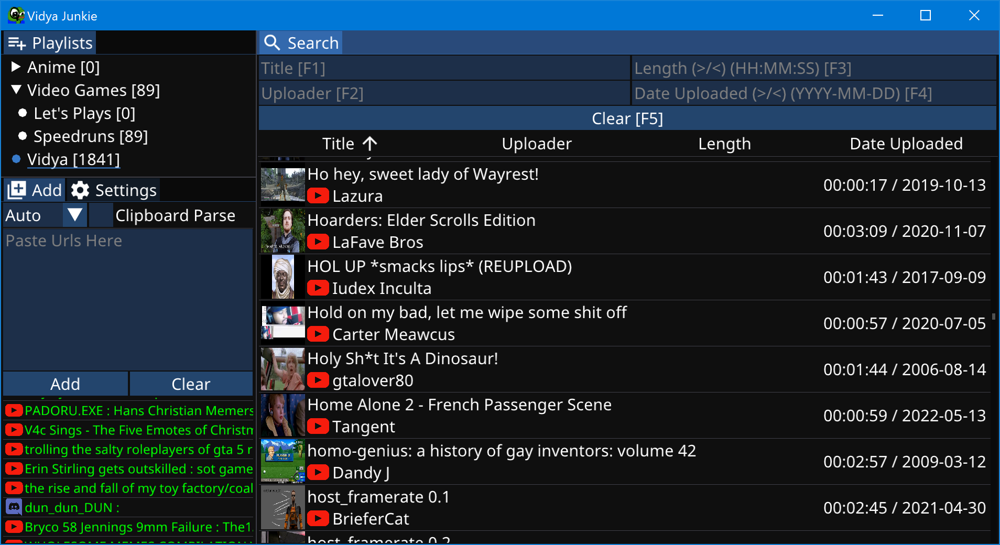

# Vidya Junkie
Vidya Junkie is a program to organize and search web videos, it can quickly parse videos from Youtube (Videos, Playlists, Channels), Vimeo, NicoVideo, Dailymotion, Streamable and most Raw videos (url's ending with .mp4, .mov etc...)

# Demo (Click Image)

# Features and Usage
Organize videos in folders and playlists, right click to rename or remove, drag and drop to restructure, select playlists (shift click) to search or add videos to  
Parse video data from urls, and add to selected playlists  
Automatically parse urls and add to selected playlists when copied to clipboard  
Will automatically download and save thumbnails, even for Raw videos  
Add videos manually, supporting any url and domain  
Fast and smart search, fuzzy search, auto complete, filter videos by uploader, date and length  
Sort videos by title, uploader, length, date uploaded  
Double click result entry to open video in browser, select videos (shift click) and press Ctrl + C to copy video urls, right click to edit video data, remove, create Streamable clip. drag and drop videos to move to different playlists
Change gui scaling in Settings tab  

# Download
You can download the program from the release page [here](https://github.com/TangentOnline/VidyaJunkie/releases)

# Build Locally
Download and install .NET 7 SDK: https://dotnet.microsoft.com/en-us/download/dotnet/7.0  
Git Clone or download the repository to your local machine  
Open a terminal in the root directory of the repo, same folder as .sln file and .csproj file  
Run: "dotnet run -c Debug" for debugging and developing  
Run: "dotnet publish -c Release -p:ExtraDefineConstants=\"PUBLISH\"" for final publishing, .exe will be in Build/Release/pub, This will copy all of the data from Resource folder, which you might want to clear out before sharing. .exe file and Resource folder need to be kept together next to each other for the .exe to run  

# Known limitations
Cannot render emojis or other unicode characters over unicode 2^16 
Certain obscure text glyphs are not packed into the font atlas, so they are not rendered

# Troubleshooting
"My window is just black":  
    Try going into the Resource\Settings.json file and change "fontSize" to be something smaller like 32
